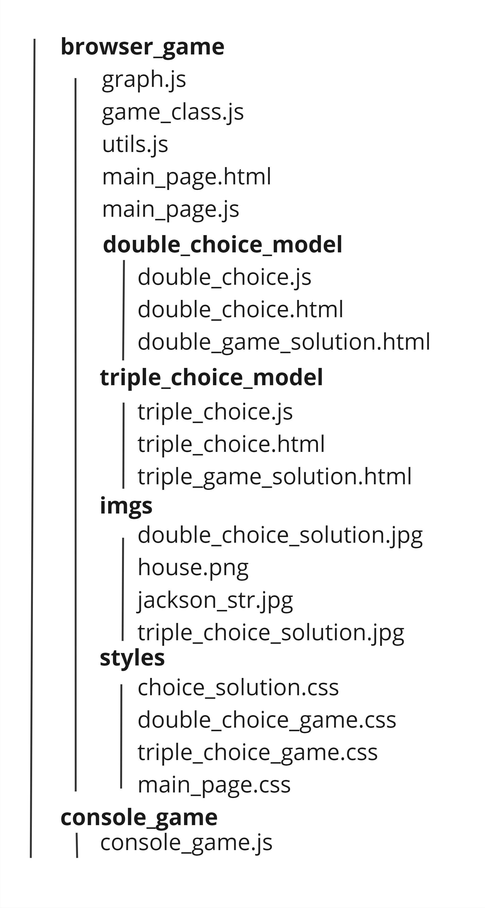

### Web-игра на основе дилеммы заключенного

__
 Описание 
__

__Цель игры:__ отгадать стратегию противника за наименьшее количество раундов.

__Базовая версия игры__ называется Double Choice model. Она основана на стандартной матрице для дилеммы заключенного. Игроку предстоит выбирать между 8 возможными стратегиями.

Для удобства внутри самой игры есть 4 вспомогательных элемента:
   1. Матрица выборов, в которой подсвечивается альтернатива, реализованная на предыдущем шаге.
   2. График, на котором отображается количество очков и игрока и соперника на каждом шаге.
   3. Логгер с историей ходов.
   4. Интерактивное описание всех стратегий - неправильно отгаданная стратегия закрашивается красным цветом, пользователь также сам может покрасить любую стратегию в красный, серый или зеленый цвет (на данный момент пример реализован только в стратегии detective)

Игра заканчивается, как только пользователь правильно отгадывает стратегию противника.

К данной версии игры приложено дерево решений минимальной глубины.

Также реализована консольная версия этой игры.

__Улучшенная версия игры__ называется Triple Choice model. К ней приложено экономическое обоснование выборов, а сама матрица расширена до трех возможных альтернатив на каждом шаге. Это позволило сделать стратегии более сложными. Также добавлены противники, которые делают выбор, опираясь на текущий счет. Всего в этой версии игры 12 стратегий. Интерфейс реализован аналогично варианту Double Choice. Для модели также добавлено дерево решений.

__Структура web-приложения:__ Всего 5 страниц. На главной странице описана каждая игра, стратегии и мотивация. Имеется 4 кнопки, отвечающие за переходы на страницы соотвествующих игр и решений.

__
 Реализация 
__

Проект реализован полностью на frontend-части web-приложения. Язык разработки - JavaScript. Дополнительные библиотеки, которые использовались - chart, readline-sync, color. Верстка и анимация блоков - HTML и CSS.

__Структура проекта:__ 

В папке browser_game лежат все файлы для реализации web-игры: 
* graph.js содержит класс, отвечающий за создание и обновление графика в двух моделях.
* game_class.js содержит класс, реализующий саму игру в зависимости от модели.
* utils.js содержит несколько классов, в которых реализованы все стратегии для двух версий игры, а также несколько вспомогательных функций.
* в main_page.html, main_page.js реализованы интерфейс главной страницы и её функционал.
* отдельные файлы, реализующие интерфейс, функционал страницу с решением для каждой из игр лежат в соотвествующих папках - double_choice_model, triple_choice_model.

В отдельной папке styles находятся все файлы со стилями для страниц, в папке imgs лежат изображения которые используются на страницах. 
